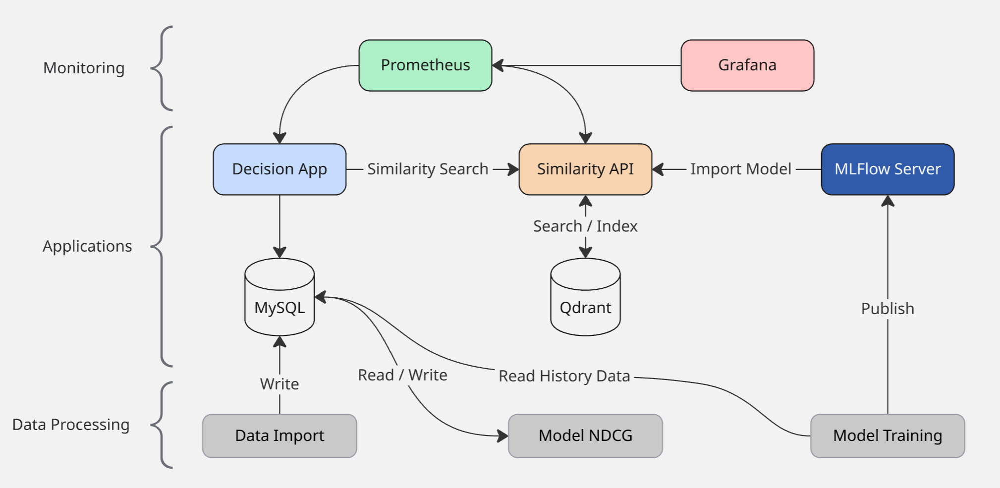

# 2MLET Datathon - Fase 5

## Sobre
Este projeto faz parte do quinto módulo da pós-tech FIAP de Machine Learning Engineering.

## Proposta
A ideia do projeto é utilizar um modelo de ML para ajudar a empresa Decision nos processos de recrutamento e seleção. Neste projeto em particular foi criado uma API que utiliza um modelo que calcula a semelhança entre candidatos e vagas de acordo com os dados apresentados. 

## O Modelo
O modelo utilizado é um BERT pré-treinado. Utilizamos esse modelo para analisar os dados textuais e gerar embeddings. Mas antes, o modelo precisa de um fine-tunning utilizando os dados históricos de processos seletivos anteriores, fazendo o uso das anotações que informam se um candidato foi contratado, se desistiu ou se foi recusado.

## Como Funciona
A partir dos dados históricos será criado um score artificial dos candidatos em relação as vagas que eles se candidataram. Esse score será usado para realizar o fine-tunning do modelo BERT e também para avaliar o score do modelo utilizando NDCG.
Depois que o modelo for treinado cada novo candidato, ou vaga, que é inserido no sistema irá disparar um processo de indexação onde os dados textuais mais relevantes são enviados para uma API que fará uso do Modelo treinado para gerar os Embeddings dos dados e então enviar os Vetores para uma banco Qdrant. A partir do momento que os dados estão nas coleções dentro do banco vetorial será possível realizar buscas utilizando os IDs (tanto das vagas quanto dos candidatos) e encontrar registros que são similares. A busca é feita utilizando distância de Cosseno.

# Pré-Requisitos
Para rodar esse projeto localmente será necessário:
- Make (Automações)
- Python >= 3.13 
- Docker
- Java 17 (para rodar o Spark nos notebooks)
- Datasets disponibilizados pela FIAP

Também será necessário realizar o build e instalar as libs do projeto com o make, vide o passo a passo de como subir o ambiente local.

# Containers
O ecossistema criado nesse projeto é feito a partir de um Docker compose que inicializa diversos containers. Nem todos os cantainers são essenciais. Alguns containers são para exemplificar o processo de CI/CD como no caso de publicar uma lib python no pypi server. Outros container possíveis para o CI/CD podem não estar presentes, como o Jenkins, mas todos os passos podem ser feitos com o make.

- **decision-app** - Sistema (frontend) onde as vagas e os candidatos são exibidos
- **similarity-api** - API de similaridade entre vagas e candidatos
- **grafana** - Sistema de monitoramento e dashboards
- **prometheus** - Sistema de captura de métricas
- **mlflow-server** - Servidor do MLFlow com repositório de modelos.
- **qdrant** - Banco de dados vetorial
- **mysql** - Banco de dados relacional para a aplicação
- **pypiserver** - Servidor de libs python para publicar as nossas libs



# Subindo o ambiente Local
Para poder termos o ambiente local funcionando precisamos executar alguns passos, esses passos precisam
ser executados em um shell (bash/sh) e que tenha o make instalado. Todas as tarefas desse projeto estão descritas no Makefile e são elas que vamos utilizar para passar por todos os passos do desenvolvimento.

## Preparando o ambiente virtual
```sh
# Cria o virtual env e instala os requirements
python -m venv .vemv
pip install --upgrade pip
pip install -r requirements.txt
```
### Construindo e instalando as bibliotecas

```sh
# Constroi e instala as bibliotecas desenvolvidas nesse projeto
make build-python-libraries
make install-libraries
```
### Executando os testes automatizados (Opcional)
```sh
# (Opcional)
# Roda os testes das bibliotecas e da API
make run-libraries-test
make run-api-test
```
### Subindo os Containers
Antes de iniciarmos os containers precisamos criar as imagens docker das aplicações:
```sh
# Cria as imagens docker do App e da API
make build-images
```
### MySQL
Vamos iniciar primeiro o MySQL para receber o import dos dados que a FIAP nos entregou.
```sh
# Inicia o MySQL. O acesso é feito com as credenciais padrões: user: decision / pass: 1234
make start-mysql-server
```
```sh
# Inicia um client do MySQL via terminal para verificarmos se o banco está funcionando.
# utilize a senha 1234. Após conectar rode o comendo SHOW DATABASES para verificar se o banco decision foi criado.
make run-mysql-client
```

#### Ingestão e pré-processamento dos Datasets
```sh
# Essa task roda um Notebook (data_engineering/preprocessing_data.ipynb)
make restore-database
```
Ao fim dessa task execute novamente o client mysql para verificar se os dados estão no banco decision.

### Decision App
```sh
# Este comando irá iniciar o container da aplicação frontend da Decision
make start-decision-app
```
Para verificar se está tudo certo acesse o app em http://localhost:3001/vacancies e então uma lista de vagas deverá ser exibida

### Similarity API
A API de similaridade precisa de um modelo treinado e disponível no MLflow Server antes de ser iniciada, portanto, vá até a sessão de [Treinando o Modelo](#treinando-o-modelo) e quando um modelo estiver treinado volte aqui para iniciar a API

Se você já tem um modelo treinado então agora é necessário configurar o arquivo de configuração da API. Edite o arquivo **env.yaml** que está na pstas **similarity_api** colocando a versão do modelo que você treinou.

```sh
make start-similarity-api
```

### Monitoramento
A API de similaridade é monitorada utilizando Prometheus e Grafana. Para iniciar esses containers rode o comando:
```sh
make start-monitoring
```
Acesse http://localhost:3000/dashboards para acessar o Grafana. (user: admin / pass: admin) e entre no dashboard **Similarity API**

# Treinando o Modelo
O processo de treino do modelo é bem custoso, recomendo a utilização de uma GPU, se for utilizar uma GPU AMD é necessário instalar o ROCm
```sh
pip install torch torchvision torchaudio --index-url https://download.pytorch.org/whl/rocm6.3
```
```sh
# Executa o treino do modelo. Notebook: model/scripts/model_train.ipynb
make run-model-train
```

# Avaliação do Modelo
O método escolhido para avaliar o modelo após o treino, além das métricas extraídas durante o treino, como (Pearson Cosine e Spearman Cosine), foi o NDCG.
O processo de avaliação utilizando o NDCG depende de uma base de dados com scores para ser comparada com os scores gerados pelo modelo. Para o caso aqui em questão estamos gerando essa base a partir do histórico de candidatos que passaram por processo seletivo e o status que eles possuem nesse processo, quanto mais próximo de ser contratado o score é maior e quanto mais próximo da recusa do cliente, ou falta de interesse na vaga, o score é menor.
Tanto o dataset de teste quanto o processo de cálculo do NDCG são executados no notebook (**model/scripts/ndcg_evaluation.ipynb**) e o resultado é registrado no banco de dados MySQL para ser exibido no painel de monitoramento do Grafana.

Execução do teste
```sh
make run-ndcg-evaluation
```

# Indexação dos dados históricos no Qdrant
Quando todos os sistemas estiverem funcionando você ainda não verá nenhuma recomendação de similaridade no App da Decision porque a base de dados vetorial ainda está vazia. Para popular essa base com os dados históricos você precisa executar a seguinte task
```sh
make restore-vector-database
```
**ATENÇÃO:** Este comando executa o notebook **data_engineering/vectors_indexing.ipynb** que utiliza uma versão do modelo deployado no MLFLow, por isso, antes de executar é importante verificar se a versão que o script vai utilizar existe no seu MLFlow Server.


 